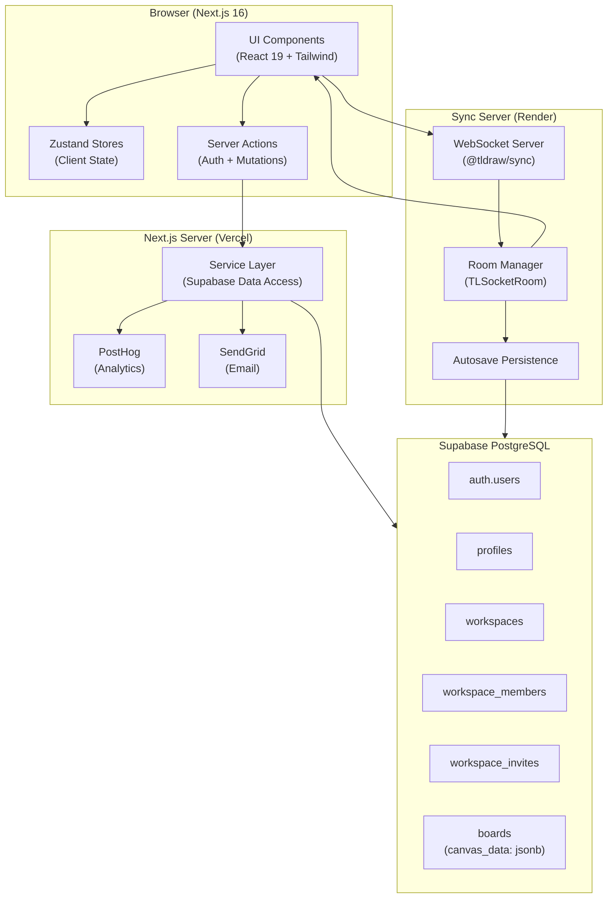
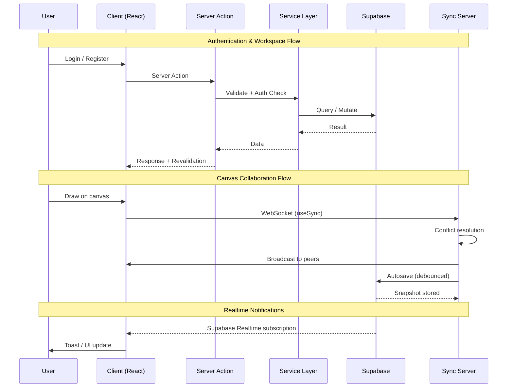
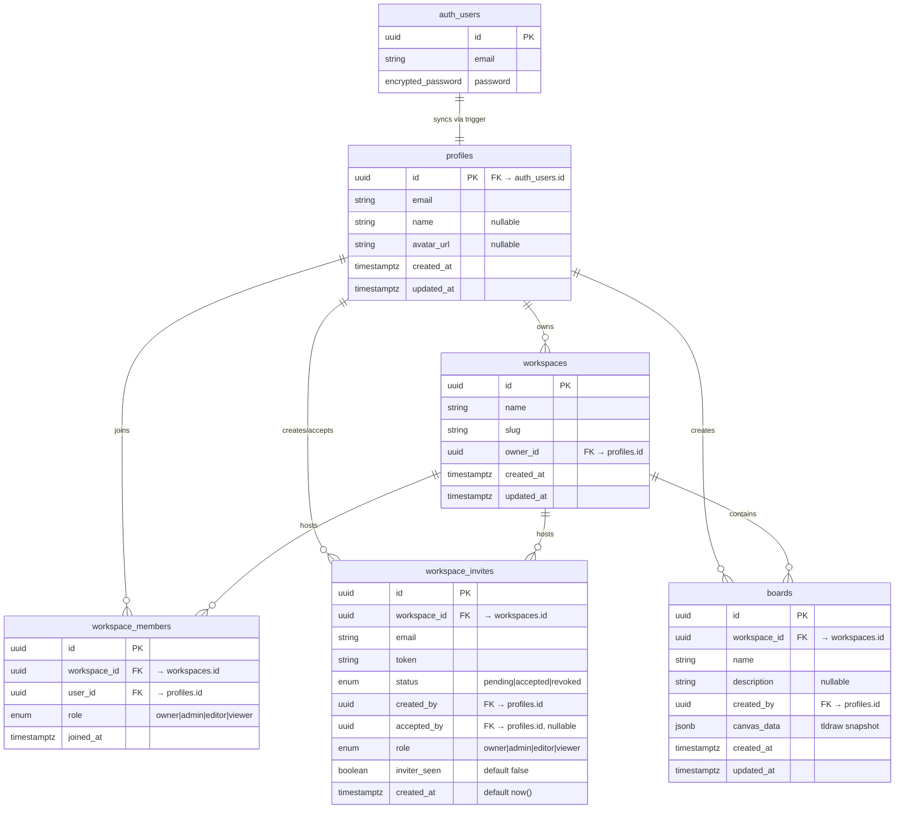
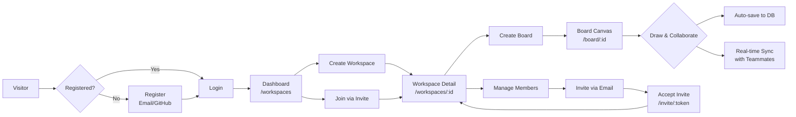

<p align="center">
  <picture>
    <source media="(prefers-color-scheme: dark)" srcset="/logo.webp">
    
  </picture>
</p>

<h1 align="center">🎨 Zentrox Whiteboard</h1>

<p align="center">
  <em>Infinite multiplayer canvas for visual thinkers — built for teams who design, diagram, and collaborate in real-time.</em>
</p>

<p align="center">
  <a href="https://zentrox-one.vercel.app"></a>
  <a href="#-tech-stack"></a>
  <a href="#-tech-stack"></a>
  <a href="#-tech-stack"></a>
  <a href="#-tech-stack"></a>
  <a href="https://whiteboardsaas2.onrender.com"></a>
  <a href="docs/code-review-report.md"></a>
  <a href="#"></a>
</p>

---

## 📋 Table of Contents

- [Overview](#-overview)
- [Architecture](#-architecture)
- [Features](#-features)
- [Tech Stack](#-tech-stack)
- [Database Schema](#-database-schema)
- [User Flow](#-user-flow)
- [Project Structure](#-project-structure)
- [Quick Start](#-quick-start)
- [Available Scripts](#-available-scripts)
- [Deployment](#-deployment)
- [Documentation](#-documentation)

---

## 🌟 Overview

**Zentrox** is a production-ready, collaborative whiteboard application that combines the power of **Next.js 16**, **Supabase**, and **tldraw** to deliver a seamless real-time sketching experience.

Users can create **workspaces**, invite **team members** with granular roles (Owner, Admin, Editor, Viewer), manage **boards**, and collaborate on an **infinite vector canvas** — all synced in real-time via a dedicated WebSocket sync server.

> **Live App:** [https://zentrox-one.vercel.app](https://zentrox-one.vercel.app)
> **Sync Server:** [https://whiteboardsaas2.onrender.com](https://whiteboardsaas2.onrender.com)

---

## 🏗️ Architecture

### System Architecture



### Data Flow



---

## 🚀 Features

<table>
  <tr>
    <td width="50%">
      <h3>🔐 Authentication</h3>
      <p>Email/password + GitHub OAuth via Supabase SSR. Secure session validation, public profile syncing, and protected route guards.</p>
    </td>
    <td width="50%">
      <h3>🏢 Workspaces</h3>
      <p>Isolated spaces for boards and team collaboration. Full CRUD with role-based access control (Owner, Admin, Editor, Viewer).</p>
    </td>
  </tr>
  <tr>
    <td>
      <h3>👥 Team Management</h3>
      <p>Token-based workspace invites with role selection. Real-time member presence, role updates, and leave/kick workflows.</p>
    </td>
    <td>
      <h3>✏️ Vector Canvas</h3>
      <p>Infinite tldraw canvas with shapes, arrows, text, sticky notes, freehand drawing. Read-only mode for editors/viewers.</p>
    </td>
  </tr>
  <tr>
    <td>
      <h3>⚡ Real-Time Sync</h3>
      <p>Multiplayer WebSocket sync server enabling live cursor presence, collaborative editing, and conflict resolution.</p>
    </td>
    <td>
      <h3>💾 Auto Persistence</h3>
      <p>Automatic JSONB serialization of canvas state to Supabase PostgreSQL. Debounced saves with status indicators.</p>
    </td>
  </tr>
  <tr>
    <td>
      <h3>🔔 Notifications</h3>
      <p>Real-time notification inbox for workspace invites and member activity via Supabase Realtime subscriptions.</p>
    </td>
    <td>
      <h3>⚙️ Settings</h3>
      <p>Comprehensive settings modal — profile, workspace management, notifications, appearance (dark mode), account, members, invites.</p>
    </td>
  </tr>
  <tr>
    <td>
      <h3>📱 Responsive UX</h3>
      <p>Mobile-first design with fluid layouts, touch gestures, and responsive navigation across all device sizes.</p>
    </td>
    <td>
      <h3>📊 Analytics & SEO</h3>
      <p>PostHog session recording & analytics, Vercel Speed Insights, dynamic sitemap, robots.txt, semantic HTML.</p>
    </td>
  </tr>
</table>

---

## 🛠️ Tech Stack

| Layer | Technology | Purpose |
|:------|:-----------|:--------|
| **Framework** | Next.js 16 (App Router, Turbopack) | Full-stack React framework with SSR, RSC, and server actions |
| **UI Library** | React 19, TypeScript | Type-safe component architecture |
| **Styling** | Tailwind CSS v4, shadcn/ui, Aceternity UI, Radix Primitives | Utility-first styling + accessible component primitives |
| **Animations** | Motion (framer-motion), tw-animate-css | Declarative animations and transitions |
| **Icons** | Lucide React | Consistent iconography throughout the app |
| **State** | Zustand | Lightweight client-side state management (6 stores) |
| **Forms** | React Hook Form + Zod 4.4.3 | Type-safe form validation with schema inference |
| **Database** | Supabase PostgreSQL | Relational data + Realtime subscriptions |
| **Auth** | Supabase SSR SDK | Email/password + GitHub OAuth |
| **Canvas** | tldraw 5.1.0, @tldraw/sync, @tldraw/sync-core | Infinite vector whiteboard with real-time sync |
| **Analytics** | PostHog (posthog-js, posthog-node) | Product analytics and session recording |
| **Email** | SendGrid (@sendgrid/mail) | Transactional emails for workspace invites |
| **Testing** | Vitest, @testing-library/react, jsdom | 284 unit/integration tests across 26 files |
| **Infrastructure** | Vercel (hosting), Render (sync server) | Production deployment |
| **Monitoring** | @vercel/analytics, @vercel/speed-insights | Performance and usage monitoring |

---

## 📊 Database Schema



### Key Relationships

- **Auth → Profile:** A database trigger automatically creates a `profiles` row when a new `auth.users` record is inserted.
- **Workspace → Members:** When a workspace is created, an `owner` row is inserted into `workspace_members` for the creator.
- **Workspace → Boards:** Boards belong to a workspace; membership is inherited through workspace membership.
- **Realtime Enabled:** `workspace_members` and `workspace_invites` tables have Supabase Realtime enabled for live notifications.

---

## 👤 User Flow



---

## 📁 Project Structure

```
whiteboard-canvas/
├── src/                          # Application source code
│   ├── actions/                  # Next.js Server Actions
│   │   ├── auth.ts               #   Sign out, auth utilities
│   │   ├── board.ts              #   Board create/update/delete
│   │   ├── invite.ts             #   Invite create/accept/revoke
│   │   ├── member.ts             #   Member CRUD + role management
│   │   ├── profile.ts            #   Profile updates
│   │   ├── settings.ts           #   Settings mutations
│   │   └── workspace.ts          #   Workspace create/delete
│   ├── app/                      # Next.js App Router (pages, layouts)
│   │   ├── (auth)/               #   Login, register, password reset
│   │   ├── (landing)/            #   Home, about, pricing, contact
│   │   └── (protected)/          #   Workspaces, boards, invites
│   ├── components/               # React components
│   │   ├── auth/                 #   Auth forms, buttons, decorations
│   │   ├── board/                #   Board cards, lists, dialogs
│   │   ├── landing/              #   Hero, features, footer, navbar
│   │   ├── settings/             #   Settings modal (12 components)
│   │   ├── shared/               #   ErrorBoundary, UnauthorizedAccess
│   │   ├── ui/                   #   shadcn/ui & custom (23 components)
│   │   ├── whiteboard/           #   tldraw canvas, sync hooks, overlays
│   │   └── workspace/            #   Dashboard, members, invites, notifications
│   ├── hooks/                    # Custom React hooks
│   ├── lib/                      # Utilities (constants, utils, avatar, posthog)
│   ├── services/                 # Supabase data access layer
│   ├── store/                    # Zustand stores (6 stores)
│   ├── types/                    # TypeScript types & Zod schemas
│   ├── utils/supabase/           # Supabase client/server helpers
│   ├── __tests__/                # Vitest test suite (284 tests)
│   └── proxy.ts                  # Auth middleware route guard
├── sync-server/                  # WebSocket sync server (Render)
│   ├── server.ts                 #   Entry point (HTTP + WS)
│   ├── auth.ts                   #   JWT verification
│   ├── connection.ts             #   Socket routing
│   ├── rooms.ts                  #   Room registry + autosave
│   ├── persistence.ts            #   DB snapshot operations
│   ├── database.ts               #   Supabase client
│   └── config.ts                 #   Environment config
├── supabase/migrations/          # 6 SQL migration files
├── docs/                         # Full documentation suite
└── public/                       # Static assets (logos, icons)
```

> **Total:** 173 TypeScript source files | 26 test files | 284 tests | 6 stores | 7 actions | 6 services

---

## ⚡ Quick Start

### Prerequisites

- **Node.js 18+** and **npm**
- **Supabase account** (free tier) — [supabase.com](https://supabase.com)
- **SendGrid account** (optional, for invite emails) — [sendgrid.com](https://sendgrid.com)

### Setup

```bash
# 1. Clone the repository
git clone <repository-url>
cd whiteboard-canvas

# 2. Install dependencies
npm install

# 3. Copy environment variables
cp .env.example .env.local
```

### Configure Environment

Edit `.env.local` with your Supabase credentials:

```env
# Supabase (required)
NEXT_PUBLIC_SUPABASE_URL=https://your-project.supabase.co
NEXT_PUBLIC_SUPABASE_PUBLISHABLE_KEY=your-anon-key

# Sync Server (for local development)
NEXT_PUBLIC_SYNC_SERVER_URL=http://localhost:8787

# Optional (for invites)
SENDGRID_API_KEY=SG.your-key
SENDGRID_FROM_EMAIL=noreply@zentrox.app
```

### Run

```bash
# Start the Next.js dev server
npm run dev

# In another terminal, start the sync server (for collaboration features)
npm run sync

# Or run both together
npm run dev:all
```

Open [http://localhost:3000](http://localhost:3000) to start using Zentrox.

> **Note:** Apply the Supabase migrations before first use. See the [database docs](docs/database.md) for details.

---

## 📦 Available Scripts

| Script | Description |
|:-------|:------------|
| `npm run dev` | Start Next.js dev server (Turbopack) on `:3000` |
| `npm run build` | Build for production (type-check + lint + compile) |
| `npm run start` | Start production server |
| `npm run lint` | Run ESLint across the codebase |
| `npm run test` | Run Vitest test suite (284 tests) |
| `npm run test:watch` | Run tests in watch mode |
| `npm run test:coverage` | Run tests with coverage report |
| `npm run sync` | Start WebSocket sync server on `:8787` |
| `npm run dev:all` | Run dev server + sync server concurrently |

---

## 🚢 Deployment

| Service | Provider | URL |
|:--------|:---------|:----|
| **App** | Vercel | [https://zentrox-one.vercel.app](https://zentrox-one.vercel.app) |
| **Sync Server** | Render | [https://whiteboardsaas2.onrender.com](https://whiteboardsaas2.onrender.com) |

For a complete deployment walkthrough — including environment variables, Supabase redirect configuration, and sync server setup — see the **[Deployment Guide](docs/deployment.md)**.

---

## 📚 Documentation

Full technical documentation is available in the `docs/` directory:

| Document | Content |
|:---------|:--------|
| **[Architecture](docs/whiteboard.md)** | Runtime flow, persistence layers, canvas sync pipeline |
| **[Database](docs/database.md)** | Schema diagrams, tables, columns, migrations |
| **[Phases & Roadmap](docs/phases.md)** | Build milestones and development history |
| **[Progress Tracker](docs/progress.md)** | Task checklist across all build stages |
| **[Deployment](docs/deployment.md)** | Vercel + Render setup, env vars, auth redirects |
| **[Agent Guide](AGENT.md)** | Developer/AI agent conventions, patterns, file placement |
| **[Code Review](docs/code-review-report.md)** | Quality metrics, static analysis, scorecard (A+) |

---

## 🧪 Testing

The project maintains a comprehensive test suite:

```
📁 src/__tests__/
├── actions/        # Server Action tests (6 files)
├── components/     # Component tests (1 file)
├── hooks/          # Hook tests (1 file)
├── lib/            # Utility tests (3 files)
├── services/       # Service layer tests (6 files)
├── store/          # Zustand store tests (6 files)
└── types/          # Schema/type tests (3 files)
```

**Total:** 284 tests across 26 files — all passing.

---

## 📊 Code Quality

| Metric | Status |
|:-------|:-------|
| ESLint | ✅ 0 errors, 0 warnings |
| TypeScript | ✅ Strict mode, **0 `any`** in source code |
| Build | ✅ Compiles successfully |
| Tests | ✅ 284/284 passing |
| Dependencies | ✅ 0 high-severity vulnerabilities |
| Documentation | ✅ 7 documents, fully consistent |

Overall score: **A+ (100/100)** — see the [full report](docs/code-review-report.md).

---

## 🤝 Contributing

1. Read the **[Agent Guide](AGENT.md)** for codebase conventions and patterns
2. Review the **[phases](docs/phases.md)** and **[progress tracker](docs/progress.md)** for current priorities
3. Follow the existing patterns: Server Actions → Service Layer → Supabase
4. Ensure all tests pass before submitting changes: `npm test`
5. Run lint and build: `npm run lint && npm run build`

---

## 📄 License

This project is **private** — all rights reserved.

---

<p align="center">
  Built with ❤️ using Next.js 16, Supabase, and tldraw
</p>
