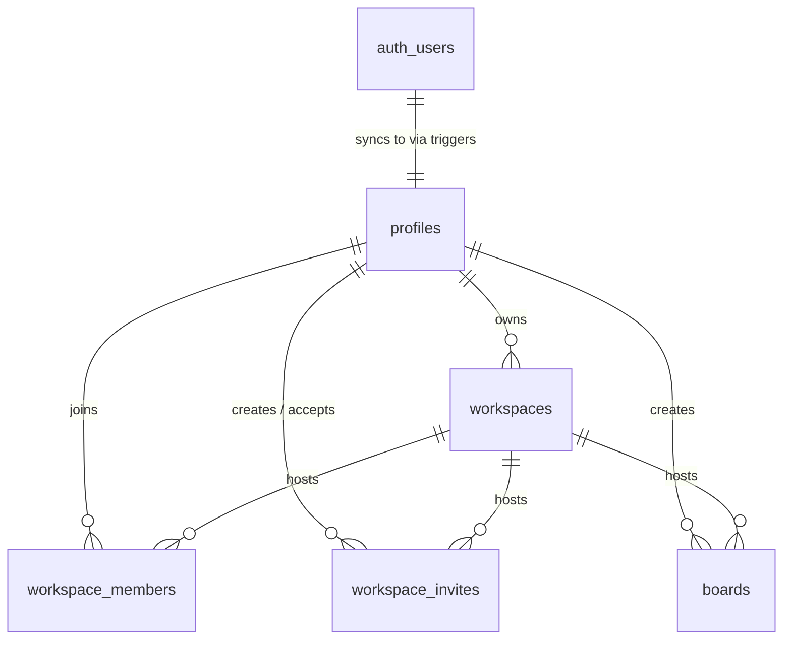

# 🎨 Zentrox Whiteboard

Zentrox is a high-performance, collaborative workspace-based whiteboard application built on Next.js 16 App Router, React 19, and Supabase. It features real-time workspace collaboration, granular workspace membership and invite flows, whiteboard canvas sketching, and automated database persistence.

---

## 📂 Repository Documentation

Detailed system architecture and database documentation can be found in the `docs/` folder:

*   **[System Architecture](docs/Whiteboard.md):** Client runtime flow, persistence layers, and state handling.
*   **[Database Design](docs/DATABASE.md):** Complete schema diagrams, relations, triggers, and migrations.
*   **[Build Phases & Roadmap](docs/PHASES.md):** Overview of core milestones.
*   **[Timeline Tasks Log](docs/timestamp.md):** Progress tracking of milestones.
*   **[Developer & Agent Guide](AGENT.md):** Guidelines for codebase patterns, file placement, and naming conventions.
*   **[Vercel Deployment Guide](docs/DEPLOYMENT.md):** Detailed guide to deploying the app to Vercel and configuring Supabase URL/Redirects.

---

## 🚀 Key Features

*   **🔐 Multi-Tenant Authentication:** Built on Supabase SSR with secure session validation and public profile syncing.
*   **🏢 Workspace Isolation:** Isolated spaces for boards and team management, preventing data bleeding.
*   **👥 Real-Time Collaborators (Stage 3):** Manage team roles (Owner, Admin, Editor, Viewer) with secure token-based workspace invitation flows.
*   **📋 Board CRUD (Stage 4):** Create, edit, and delete multiple boards per workspace.
*   **✏️ Vector Sketch Canvas (Stage 5):** Embed dynamic infinite drawing boards with shapes, arrows, text, and vector freehands.
*   **💾 State Persistence (Stage 5):** Automatic JSONB serialization of whiteboard canvas data directly to Supabase PostgreSQL.

---

## 🛠️ Technology Stack

| Layer | Technologies |
| :--- | :--- |
| **Core Framework** | Next.js 16 (App Router, Turbopack), React 19, TypeScript |
| **Styling & UI** | Tailwind CSS v4, shadcn/ui, Radix UI Primitives, Lucide Icons, Sonner |
| **State Management** | Zustand (Client State), Next.js Server Actions & Route Handlers (Server State) |
| **Database & Auth** | Supabase SSR SDK, Supabase Auth, PostgreSQL |
| **Forms & Validation** | React Hook Form, Zod, `@hookform/resolvers` |

---

## 🏗️ Codebase Structure

```txt
src/
├── actions/             # Server Actions for authenticated mutations & cache revalidations
├── api/                 # Next.js API Route Handlers
├── app/                 # Next.js App Router (Layouts, pages, route segments)
│   ├── (auth)/          # Authenticated route groups (Login, Register)
│   ├── (protected)/     # Protected route groups (Workspaces, Boards)
│   └── auth/callback/   # Supabase OAuth callbacks
├── components/          # React components
│   ├── auth/            # Auth forms & layouts
│   ├── board/           # Board cards, lists, and form dialogs
│   ├── landing/         # Marketing landing page sections
│   ├── ui/              # Reusable shadcn/ui components
│   └── workspace/       # Workspace dashboard layouts & list views
├── hooks/               # Custom reusable React hooks
├── lib/                 # Shared utilities, helper libraries (e.g. cn tailwind-merge)
├── services/            # Direct Supabase PostgreSQL data-access layer
├── store/               # Zustand global client-side stores (Workspaces, Boards)
├── types/               # Shared TypeScript models and Zod schemas
├── utils/supabase/      # Supabase server, client, and middleware clients
└── proxy.ts             # Auth middleware route protection and redirects
```

---

## 📊 Database Relationships

Zentrox maps workspaces, members, invitations, and boards to Supabase Auth profiles:



---

## 💻 Local Development Setup

Follow these steps to run the application locally:

### 1. Prerequisites
Ensure you have **Node.js 18+** and **npm** installed.

### 2. Clone the Repository
```bash
git clone <repository-url>
cd whiteboard-canvas
```

### 3. Install Dependencies
```bash
npm install
```

### 4. Configure Environment Variables
Create a `.env.local` file in the root directory and populate it with your Supabase credentials:
```env
NEXT_PUBLIC_SUPABASE_URL=your-supabase-url
NEXT_PUBLIC_SUPABASE_PUBLISHABLE_KEY=your-supabase-anon-key
```

### 5. Start the Development Server
```bash
npm run dev
```
Open [http://localhost:3000](http://localhost:3000) to view it in your browser.

---

## 📦 Build & Deployment

For a full walkthrough on production deployment, see the **[Vercel Deployment Guide](docs/DEPLOYMENT.md)**.

### Build Scripts
*   `npm run dev`: Starts the Next.js development server with Turbopack.
*   `npm run build`: Generates an optimized production bundle, checking typescript and linting.
*   `npm run lint`: Analyzes codebase structure using ESLint and Next.js compiler checks.
*   `npm run start`: Starts the Next.js build bundle in production mode.

### Production Build Command
To compile the production build, run:
```bash
npm run build
```
The output directory will be created at `.next/`.
