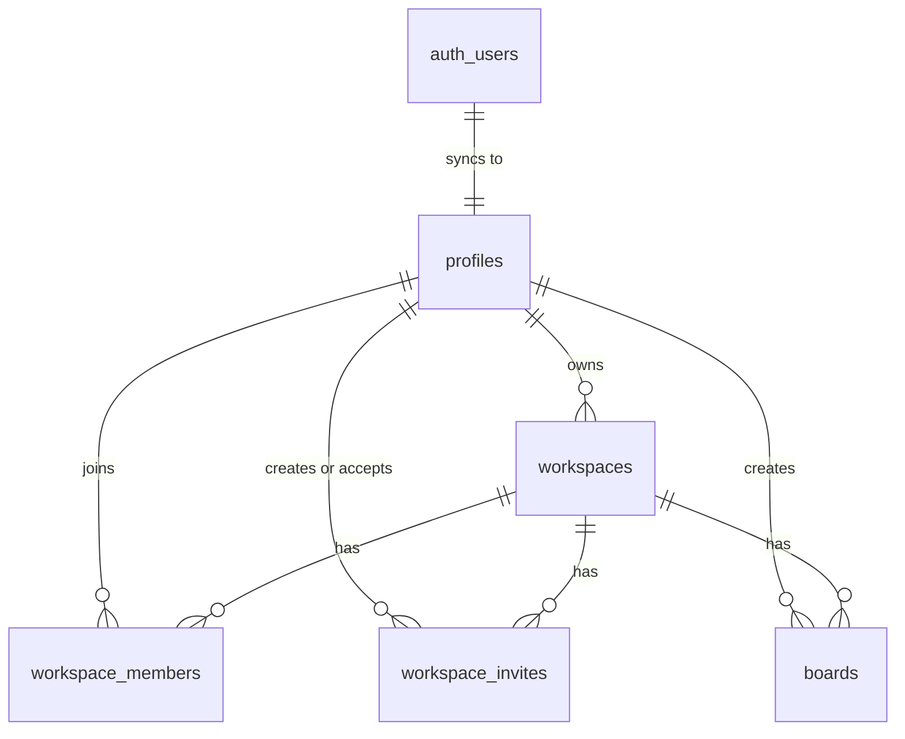

# Database Design

This document reflects the current Supabase PostgreSQL schema for Zentrox.

Supabase Auth owns private identity records in `auth.users`. The application stores public user metadata in `profiles`, then uses workspaces, members, invites, and boards as the core product tables.

---

## Runtime Connection Architecture

The app uses `@supabase/ssr` clients from `src/utils/supabase/`:

1. **Client Components:** `src/utils/supabase/client.ts`
2. **Server Components / Server Actions / Route Handlers:** `src/utils/supabase/server.ts`
3. **Proxy middleware:** `createMiddlewareClient` from `src/utils/supabase/server.ts`, consumed by `src/proxy.ts`

The current service layer:

- `src/services/profile.ts` reads public profile rows by user id.
- `src/services/workspace.ts` reads, creates, and deletes owned workspaces.
- `src/actions/workspace.ts` performs auth checks, validation, and cache revalidation before calling the service layer.

---

## Relationship Overview

---

## Table `profiles`

Public profile data synced from Supabase Auth.

### Columns

| Name | Type | Constraints |
|------|------|-------------|
| `id` | `uuid` | Primary |
| `email` | `text` |  |
| `name` | `text` | Nullable |
| `avatar_url` | `text` | Nullable |
| `created_at` | `timestamptz` |  |
| `updated_at` | `timestamptz` |  |

## Table `workspaces`

Top-level container for boards and collaborators.

### Columns

| Name | Type | Constraints |
|------|------|-------------|
| `id` | `uuid` | Primary |
| `name` | `text` |  |
| `slug` | `text` |  |
| `owner_id` | `uuid` |  |
| `created_at` | `timestamptz` |  |
| `updated_at` | `timestamptz` |  |

## Table `workspace_members`

Maps users to workspaces and stores their role.

### Columns

| Name | Type | Constraints |
|------|------|-------------|
| `id` | `uuid` | Primary |
| `workspace_id` | `uuid` |  |
| `user_id` | `uuid` |  |
| `joined_at` | `timestamptz` |  |
| `role` | `WorkspaceRole` |  |

### Roles

`WorkspaceRole` currently supports:

- `owner`
- `admin`
- `editor`
- `viewer`

## Table `workspace_invites`

Stores pending or completed invitations to join a workspace.

### Columns

| Name | Type | Constraints |
|------|------|-------------|
| `id` | `uuid` | Primary |
| `workspace_id` | `uuid` |  |
| `email` | `text` |  |
| `token` | `text` |  |
| `status` | `text` |  |
| `created_by` | `uuid` |  |
| `accepted_by` | `uuid` | Nullable |
| `role` | `WorkspaceRole` |  |

## Table `boards`

Boards live inside a workspace. The drawing/canvas state is stored in `canvas_data`.

### Columns

| Name | Type | Constraints |
|------|------|-------------|
| `id` | `uuid` | Primary |
| `workspace_id` | `uuid` |  |
| `name` | `text` |  |
| `description` | `text` | Nullable |
| `created_by` | `uuid` |  |
| `created_at` | `timestamptz` |  |
| `updated_at` | `timestamptz` |  |
| `canvas_data` | `jsonb` |  |

---

## Current Implementation Notes

- Workspace creation inserts a row in `workspaces`.
- Workspace creation also inserts an owner row in `workspace_members`.
- Boards are typed in `src/types/workspace.ts`; board CRUD and canvas persistence are still planned.
- `canvas_data` is the single JSONB storage field for board drawing state.
