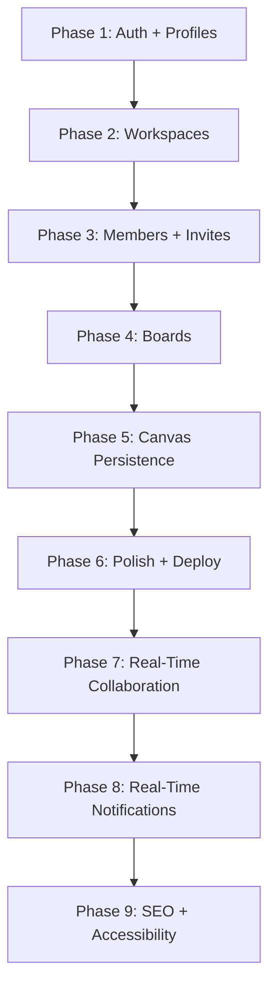
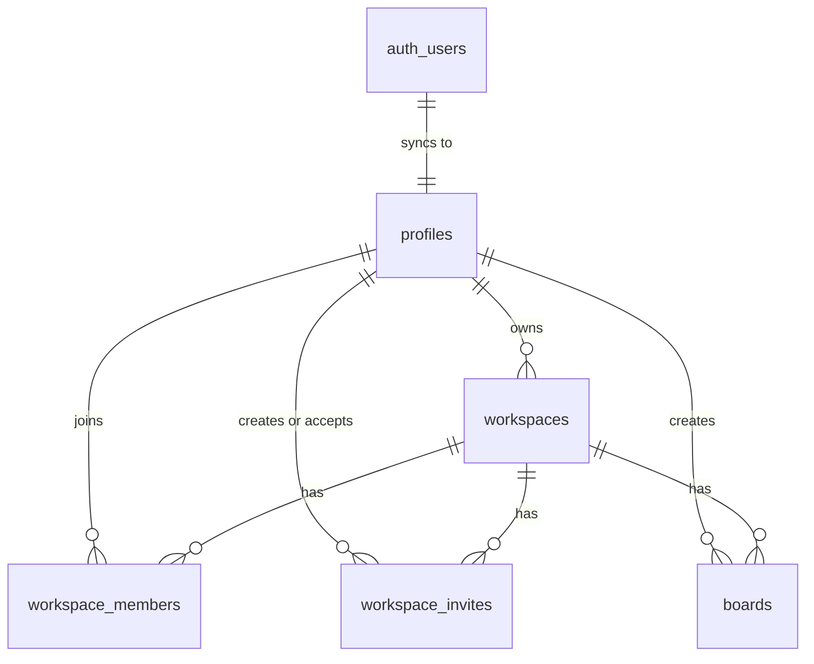

# Project Lifecycle: Practical Build Phases

This document defines the current build phases for Zentrox. It replaces the older deep roadmap with a smaller, realistic plan focused on the app being built now.

Reference docs:
- [README.md](../README.md)
- [DATABASE.md](DATABASE.md)

---

## Current Tech Stack

- **Frontend:** Next.js 16 App Router, React 19, TypeScript, Tailwind CSS v4, shadcn/ui, Radix primitives, lucide-react, Sonner
- **State, Forms, Validation:** Zustand, React Hook Form, Zod, `@hookform/resolvers`
- **Backend:** Next.js Server Actions, Route Handlers, Supabase SSR SDK
- **Database:** Supabase PostgreSQL
- **Canvas:** tldraw whiteboard with `boards.canvas_data` persistence and role-based read-only mode
- **Analytics:** Vercel Analytics

Not in the current scope: comments, AI diagram generation, AI chat, or a large realtime architecture.

---

## Build Sequence

---

## Database Entity Relationships

---

## Phase 1: Auth and Profiles

**Goal:** Users can register, log in, log out, and have a public profile row.

- Supabase email/password auth
- GitHub OAuth callback flow
- Protected routes through `src/proxy.ts`
- `profiles` table sync from `auth.users`
- Auth form validation with React Hook Form and Zod

## Phase 2: Workspaces

**Goal:** Users can create, list, and delete owned workspaces.

- `/workspaces` dashboard
- Workspace create/delete dialogs
- Workspace service layer and Server Actions
- Zustand store for hydrated workspace/user state
- Creator automatically gets an `owner` row in `workspace_members`

## Phase 3: Members and Invites ✅

**Goal:** Workspaces can support collaborators using existing database tables.

- Member list with role badges on the workspace detail page
- `InviteMemberDialog` — create invite links with role selection (owner/editor/viewer)
- Invite acceptance at `/invite/[token]` via `InviteAcceptClient`
- `useMemberStore` Zustand store for optimistic member/invite UI updates
- Member removal and role update actions (`src/actions/member.ts`)
- Invite creation, acceptance, and revocation actions (`src/actions/invite.ts`)
- `LeaveWorkspaceDialog` for non-owner members to leave a workspace
- Role-based access: board creation restricted to owners; editors/viewers get read-only canvas
- Vercel Analytics added to the root layout

## Phase 4: Boards

**Goal:** Users can create and manage boards inside a workspace.

- Board list inside `/workspaces/[workspaceId]`
- Board create/edit/delete actions
- Board detail route at `/board/[boardId]`
- Board ownership/access checks through workspace membership

## Phase 5: Canvas Persistence ✅

**Goal:** Users can open a board, draw, save, and reload their canvas.

- tldraw canvas embedded in `/board/[boardId]`
- Load board `canvas_data` from Supabase on open
- Auto-save canvas changes back to `boards.canvas_data`
- Basic save status and error indicators
- Role-based read-only mode: `isReadonly` set for editors and viewers

## Phase 6: Polish and Deployment Readiness

**Goal:** Make the core app stable enough to deploy.

- Not-found and empty states
- Loading states
- Form/server error consistency
- Environment variable docs
- `npm run lint` and `npm run build`

## Phase 7: Real-Time Collaboration ✅

**Goal:** Enable live multi-user editing on the same board using a custom tldraw WebSocket sync server and TLSocketRoom presence.

- tldraw sync backend: WebSocket server (`@tldraw/sync`, `@tldraw/sync-core`)
- Replace single-user `Tldraw` with `useSync` hook in `WhiteboardCanvas`
- Asset store for file/image uploads within the canvas
- Room persistence and reconnection handling on the backend
- Live cursor presence for connected users
- Test concurrent edits across multiple browser sessions
- TLSocketRoom presence channel on the sync server to track active collaborators
- Live avatar stack and join/leave toast notifications showing who is currently on the canvas

## Phase 8: Real-Time Notifications and Advanced Controls ✅

**Goal:** Provide live feedback for workspace events and enhance access control dynamics.

- Real-time notification inbox for workspace activities (e.g. invites).
- Supabase Realtime subscriptions for `workspace_invites` and `workspace_members`.
- Refactored and modularized invite management UI (`InviteMemberDialog`, `workspace-invites-list`).
- Enhanced whiteboard access control with real-time revocation monitoring (`KickedOverlay`).
- New reusable UI components: `DropdownMenu`, `Pagination`.

## Phase 9: SEO, Accessibility, and Codebase Polish ✅

**Goal:** Improve search engine visibility, enhance accessibility, and resolve strict compiler/linter warnings.

- Dynamic `sitemap.ts` and `robots.ts` for SEO.
- Aceternity UI components (`HoverBorderGradient`) integrated into landing page.
- Accessibility (A11y) enhancements: improved contrast, ARIA labels, and touch targets.
- Resolution of React 19 / Next.js 15 compiler warnings (`react-hooks/purity`, `set-state-in-effect`).
- Strict typing compliance (`any` replaced with `unknown`).
- Fixed unescaped HTML entities in legal pages and empty states.

---

## Later / Optional

These features can be revisited after the core product is working:

- Realtime board chat (chat panel per board)
- AI features
- Advanced scaling infrastructure
