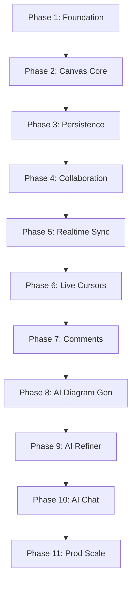
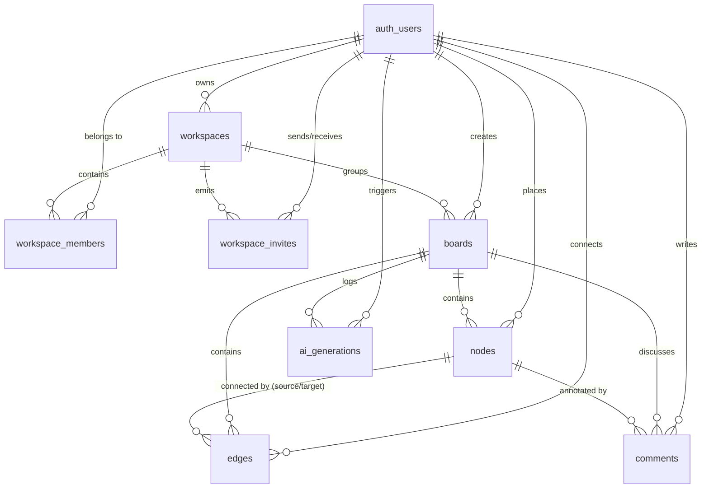

# Project Lifecycle: Phases of Creation

This document outlines the step-by-step development phases for building the **AI-Powered Collaborative Whiteboard SaaS**. It consolidates the product roadmap from [README.md](file:///home/empiric/Desktop/practice01/projects/whiteboard/README.md) with the technical schema specifications from [DATABASE.md](file:///home/empiric/Desktop/practice01/projects/whiteboard/docs/DATABASE.md) to provide a clear build workflow.

---

## 🏗️ Project Architecture & Tech Stack

Before diving into the phases, here is the technology layout:
- **Frontend:** Next.js (App Router), TypeScript, Tailwind CSS, Shadcn UI, Redux Toolkit (State Management), `tldraw` (Canvas SDK)
- **Backend:** Next.js Route Handlers & Server Actions, Supabase SDK, Supabase (PostgreSQL)
- **Realtime Infrastructure:** Supabase Realtime & Presence
- **AI Engine:** Gemini API (Structured Outputs / JSON mode for layout generation)
- **Scale Infrastructure:** Redis, Docker (Phase 11)

---

## 📈 Recommended Build Sequence



---

## 🛡️ Database Entity Relationships

All tables are implemented in **Supabase (PostgreSQL)** using `UUID` identifiers.



---

## 🏁 Phase-by-Phase Breakdown

### Phase 1: Foundation (Auth, Workspaces, and Boards)
**Goal:** Establish user management, multi-tenancy, and high-level routing boundaries.

* **Key Features:**
  - Secure registration, login, logout, and protected routes (using Supabase Auth).
  - Workspace management (Multi-tenant containment of work environments e.g., Netflix, Google, Personal).
  - Board listing and workspace-scoped dashboard CRUD actions.
* **Database Setup (V1 Minimum Tables):**
  - **`profiles`**
    | Column | Type | Constraints | Purpose |
    | :--- | :--- | :--- | :--- |
    | `id` | `UUID` | Primary Key, FK `auth.users.id` (Cascade) | User profile identity |
    | `email` | `TEXT` | NOT NULL | User email address |
    | `name` | `TEXT` | NULL | Display name |
    | `avatar_url` | `TEXT` | NULL | Profile image link |
    | `created_at` | `TIMESTAMPTZ` | DEFAULT `now()` | Timestamp |
    | `updated_at` | `TIMESTAMPTZ` | DEFAULT `now()` | Timestamp |
  - **`workspaces`**
    | Column | Type | Constraints | Purpose |
    | :--- | :--- | :--- | :--- |
    | `id` | `UUID` | Primary Key | Unique ID |
    | `name` | `TEXT` | NOT NULL | User-visible workspace name |
    | `slug` | `TEXT` | UNIQUE | URL-friendly identifier |
    | `owner_id` | `UUID` | FK `profiles.id` | Owner reference |
    | `created_at` | `TIMESTAMPTZ` | DEFAULT `now()` | Timestamp |
    | `updated_at` | `TIMESTAMPTZ` | DEFAULT `now()` | Timestamp |
  - **`boards`**
    | Column | Type | Constraints | Purpose |
    | :--- | :--- | :--- | :--- |
    | `id` | `UUID` | Primary Key | Unique ID |
    | `workspace_id`| `UUID` | FK `workspaces.id` (Cascade) | Parent workspace scope |
    | `name` | `TEXT` | NOT NULL | Board name |
    | `description` | `TEXT` | NULL | Board description |
    | `created_by` | `UUID` | FK `profiles.id` | Creator |
    | `created_at` | `TIMESTAMPTZ` | DEFAULT `now()` | Timestamp |
    | `updated_at` | `TIMESTAMPTZ` | DEFAULT `now()` | Timestamp |

---

### Phase 2: Whiteboard Core (Canvas & Elements)
**Goal:** Provide an interactive, responsive canvas that allows users to place, resize, and connect drawing components.

* **Key Features:**
  - Embedded canvas workspace with full Pan, Zoom, Selection, Resize, Undo, and Redo operations (powered by `tldraw` SDK).
  - Rich node library (Rectangles, Circles, Diamonds, Text blocks) and connection engine.
  - State serialized and stored as a JSON document in `boards.canvas_data`.

---

### Phase 3: Persistence (Auto-Save and Load)
**Goal:** Enable automatic state saving and restoration of canvas diagrams.

* **Key Features:**
  - Auto-saving logic (debounce canvas change events and submit state to database ~5 seconds after modifications).
  - Board restoration (retrieve `canvas_data` JSON when a user logs in and loads a board).

---

### Phase 4: Collaboration Setup (Members and Invites)
**Goal:** Establish user management tables and authorization layers for workspace sharing.

* **Key Features:**
  - Workspace membership list (Owner, Admin, Editor, Viewer roles).
  - Invite system (generating tokens and invite links that can be shared or emailed).
* **Database Setup (V2 Collaboration Tables):**
  - **`workspace_members`**
    | Column | Type | Constraints | Purpose |
    | :--- | :--- | :--- | :--- |
    | `id` | `UUID` | Primary Key | Unique ID |
    | `workspace_id`| `UUID` | FK `workspaces.id` (Cascade) | Workspace membership |
    | `user_id` | `UUID` | FK `profiles.id` (Cascade) | User membership |
    | `role` | `ENUM` | DEFAULT 'viewer' | WorkspaceRole enum: 'owner', 'admin', 'editor', 'viewer' |
    | `joined_at` | `TIMESTAMPTZ` | DEFAULT `now()` | Timestamp |
  - **`workspace_invites`**
    | Column | Type | Constraints | Purpose |
    | :--- | :--- | :--- | :--- |
    | `id` | `UUID` | Primary Key | Unique ID |
    | `workspace_id`| `UUID` | FK `workspaces.id` (Cascade) | Workspace invitation |
    | `email` | `TEXT` | NOT NULL | Recipient email |
    | `role` | `ENUM` | DEFAULT 'editor' | WorkspaceRole enum: 'editor', 'viewer' |
    | `token` | `TEXT` | UNIQUE, NOT NULL | Secret invitation token |
    | `status` | `TEXT` | DEFAULT 'pending' | Status: 'pending', 'accepted', 'expired', 'revoked' |
    | `created_by` | `UUID` | FK `profiles.id` | Inviter |
    | `accepted_by` | `UUID` | FK `profiles.id`, NULL | User who accepted the invite |

---

### Phase 5: Realtime Sync (Multiplayer Canvas)
**Goal:** Sync changes instantly to all users active on the same board, mimicking Google Docs collaboration.

* **Key Features:**
  - Realtime canvas event broadcasting (Node modifications, deletions, and creations propagate immediately).
  - Active user presence indicator (Avatars in header displaying online members).
* **Technology:** Supabase Realtime Channels (`broadcast` and `presence`).

---

### Phase 6: Live Cursors
**Goal:** Display real-time mouse movement of other users on the whiteboard.

* **Key Features:**
  - Multiplayer visual cursors matching username, color, and coordinates.
  - Coordinate broadcasting on client pointer-move triggers.
* **Technology:** Supabase Realtime Presence state updates under `board:<board_id>` channel using payload format:
  ```json
  {
    "x": 400,
    "y": 200,
    "name": "Tushar"
  }
  ```

---

### Phase 7: Comments (Review System)
**Goal:** Support review cycles, annotations, and in-context conversation on diagrams.

* **Key Features:**
  - Pin comment cards directly to canvas coordinates or link them directly to specific shapes/nodes.
  - Comments and discussion threads are stored within the board's JSON canvas data.
  - Reply threads and status resolutions (Open/Resolved).

---

### Phase 8: AI Diagram Generator (Text-to-Diagram)
**Goal:** Auto-generate complete structural canvas architectures from natural language prompts.

* **Key Features:**
  - Prompt input (e.g., "Generate Netflix Payment Architecture").
  - Structured Gemini API prompt formatting (returning compliant tldraw layout JSON formats).
  - Save the generated layout directly to the board's JSON canvas data and render on screen.

---

### Phase 9: AI Refiner (Diagram Auditing)
**Goal:** Enhance and optimize existing drawn architectures.

* **Key Features:**
  - AI reads full canvas nodes/edges snapshot.
  - Proposes improvements (e.g. suggesting adding Redis caches, message queues, or load balancers).
  - Automatically inserts connections or fixes naming inconsistencies.

---

### Phase 10: AI Chat Assistant (Board Context Q&A)
**Goal:** Introduce a sidebar agent that answers detailed architectural questions using the canvas as context.

* **Key Features:**
  - Chat interface that reads and understands active whiteboard nodes and connections.
  - Answers complex prompts like: "What happens when a user requests a payment?" or "Find single points of failure in this layout".

---

### Phase 11: Production Scaling
**Goal:** Performance and latency optimizations to support concurrent active users at scale.

* **Key Features:**
  - Implement Redis caching for quick state syncs and high-frequency pointer movements.
  - Docker deployment packages.
  - Comprehensive logging, tracking, CI/CD pipeline automation, and system monitoring.
  - (Optional/Scale dependent): Transition high-load elements to Kafka/RabbitMQ message brokers or microservices.
