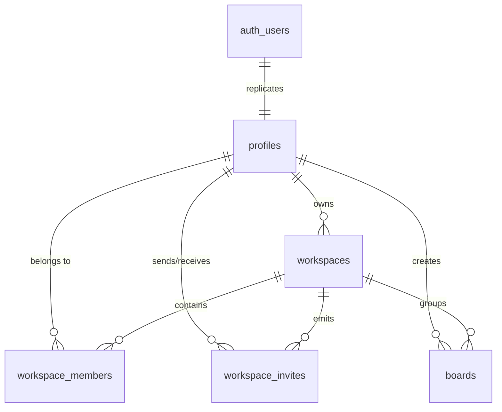
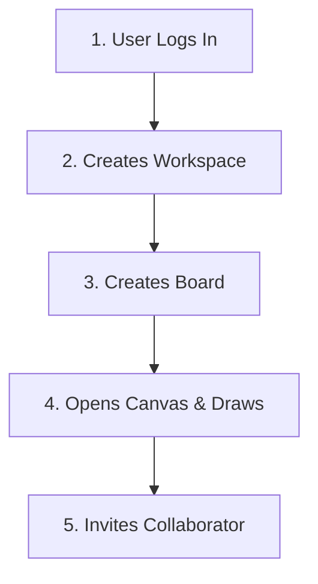

# System Architecture & Development Plan: AI-Powered Collaborative Whiteboard

This document serves as the technical reference blueprint for our **AI-Powered Collaborative Whiteboard SaaS**. It outlines the core tech stack, final database schema designs, build phases, real-time mechanics, and AI integration loops.

---

## 1. Executive Summary & Tech Stack

Our goal is to build a real-time collaborative workspace mapping drawing tools (like Miro and Excalidraw) with automated AI layout engines (powered by Gemini API). 

### The Core Technology Stack:
*   **Frontend Framework:** Next.js 15 (App Router), TypeScript, Tailwind CSS, Shadcn UI
*   **State Management:** Redux Toolkit (for global UI, workspace state, and user actions)
*   **Canvas Core:** `tldraw` SDK (handles vector canvas logic, zoom, pan, shapes, drag, selection, and undo/redo)
*   **Backend & DB:** Next.js Server Actions & Route Handlers, Supabase SDK, Supabase (PostgreSQL)
*   **Realtime Network:** Supabase Realtime Channels (Broadcast + Presence)
*   **AI Engine:** Gemini API (Structured Outputs / JSON mode for diagram generation and refinement)
*   **Infrastructure (Phase 11):** Redis (caching and high-frequency pub/sub transport), Docker containers

---

## 2. Database Schema Design (PostgreSQL / Supabase)

We leverage Supabase Auth (`auth.users`) for identity, which automatically replicates into a public `profiles` table. The core tables, constraints, and relationships are structured as follows:



### Table Definitions:

#### 0. `profiles` (Public Profiles)
| Column | Type | Constraints | Description |
| :--- | :--- | :--- | :--- |
| `id` | `UUID` | Primary Key, FK `auth.users.id` (ON DELETE CASCADE) | Unique identifier |
| `email` | `TEXT` | NOT NULL | User email address |
| `name` | `TEXT` | NULL | Display name |
| `avatar_url`| `TEXT` | NULL | Profile image link |
| `created_at`| `TIMESTAMPTZ` | DEFAULT `now()` | Registration date |
| `updated_at`| `TIMESTAMPTZ` | DEFAULT `now()` | Profile last updated |

#### 1. `workspaces` (Organizational Boundary)
| Column | Type | Constraints | Description |
| :--- | :--- | :--- | :--- |
| `id` | `UUID` | Primary Key, Default `gen_random_uuid()` | Unique identifier |
| `name` | `TEXT` | NOT NULL | User-visible workspace name |
| `slug` | `TEXT` | UNIQUE, NOT NULL | URL-friendly slug |
| `owner_id` | `UUID` | FK `profiles.id` | Owner of the workspace |
| `created_at`| `TIMESTAMPTZ` | DEFAULT `now()` | Timestamp |
| `updated_at`| `TIMESTAMPTZ` | DEFAULT `now()` | Timestamp |

#### 2. `workspace_members` (RBAC System)
| Column | Type | Constraints | Description |
| :--- | :--- | :--- | :--- |
| `id` | `UUID` | Primary Key | Unique identifier |
| `workspace_id`| `UUID` | FK `workspaces.id` (ON DELETE CASCADE) | Workspace link |
| `user_id` | `UUID` | FK `profiles.id` (ON DELETE CASCADE) | User link |
| `role` | `ENUM` | DEFAULT 'viewer' | WorkspaceRole enum: 'owner', 'admin', 'editor', 'viewer' |
| `joined_at` | `TIMESTAMPTZ` | DEFAULT `now()` | Date joined |

#### 3. `workspace_invites` (Collaboration Invites)
| Column | Type | Constraints | Description |
| :--- | :--- | :--- | :--- |
| `id` | `UUID` | Primary Key | Unique identifier |
| `workspace_id`| `UUID` | FK `workspaces.id` (ON DELETE CASCADE) | Target workspace |
| `email` | `TEXT` | NOT NULL | Recipient's email |
| `role` | `ENUM` | DEFAULT 'editor' | WorkspaceRole enum: 'editor', 'viewer' |
| `token` | `TEXT` | UNIQUE, NOT NULL | Secure invite secret |
| `status` | `TEXT` | DEFAULT 'pending' | Status: 'pending', 'accepted', 'expired', 'revoked' |
| `created_by` | `UUID` | FK `profiles.id` | Inviter user |
| `accepted_by` | `UUID` | FK `profiles.id`, NULL | User who accepted the invite |

#### 4. `boards` (Canvas Container)
| Column | Type | Constraints | Description |
| :--- | :--- | :--- | :--- |
| `id` | `UUID` | Primary Key | Unique identifier |
| `workspace_id`| `UUID` | FK `workspaces.id` (ON DELETE CASCADE) | Scope workspace |
| `name` | `TEXT` | NOT NULL | Board title |
| `description` | `TEXT` | NULL | Optional description |
| `canvas_data` | `JSONB` | DEFAULT '{}' | Dynamic tldraw canvas document elements and state |
| `created_by` | `UUID` | FK `profiles.id` | Creator profile |
| `created_at`| `TIMESTAMPTZ` | DEFAULT `now()` | Timestamp |
| `updated_at`| `TIMESTAMPTZ` | DEFAULT `now()` | Timestamp |

---

## 3. The 11 Development Phases

```
Phase 1  → Auth + Workspace Management + Board CRUD
Phase 2  → Interactive Canvas (tldraw integration, basic shape nodes & connection edges)
Phase 3  → Persistence (Debounced Auto-Save + Load Board)
Phase 4  → Collaboration setup (Workspace member tables, invites validation link)
Phase 5  → Realtime Sync (Syncing shape creations/updates/deletions via Supabase Realtime)
Phase 6  → Live Multiplayer Cursors (Cursor positions sent over Supabase Presence channel)
Phase 7  → Comments System (Threaded commentary anchored on coordinate points or shapes)
Phase 8  → AI Diagram Generation (Gemini API Structured Outputs generating JSON layout diagrams)
Phase 9  → AI Refiner (Analyzing active whiteboard coordinates and injecting suggested fixes/nodes)
Phase 10 → AI Chat Sidebar (Board-context Q&A for architectural workflows)
Phase 11 → Production Scaling (Redis socket cache implementation + Docker deployment config)
```

---

## 4. Key Engineering Flows (with Concrete Examples)

### A. Live Cursor Synchronization & Throttling (Phase 6)
When a user moves their cursor, the frontend pointer listener throttles coordinates to prevent network floods, broadcasting through the Supabase Presence channel.

#### Example Pointer Data Broadcast Payload:
```json
{
  "event": "presence",
  "payload": {
    "user_id": "9999-9999...",
    "name": "Rahul",
    "cursor_x": 451.2,
    "cursor_y": 182.7,
    "color": "#FF5733"
  }
}
```
*Frontend Rendering:* Other users' browsers receive the event, map the coordinates, and draw a smooth representation using CSS transitions:
```css
.remote-cursor {
  position: absolute;
  transition: transform 0.1s linear; /* Smooths out the 10Hz updates */
  pointer-events: none;
}
```

---

### B. AI Diagram Generator (Phase 8)
Using Gemini API's **Structured Outputs / JSON Mode**, the AI outputs a reliable data tree that matches our database constraints.

#### 1. User Prompt:
> *"Generate a microservice setup with an API gateway, User service, Database, and Cache."*

#### 2. Gemini Structured JSON Output:
```json
{
  "nodes": [
    { "id": "node_gw", "type": "rectangle", "text": "API Gateway", "x": 100, "y": 200, "width": 120, "height": 60 },
    { "id": "node_usr", "type": "rectangle", "text": "User Service", "x": 300, "y": 200, "width": 120, "height": 60 },
    { "id": "node_db", "type": "cylinder", "text": "PostgreSQL User DB", "x": 500, "y": 200, "width": 140, "height": 80 },
    { "id": "node_cache", "type": "rectangle", "text": "Redis Session Cache", "x": 300, "y": 80, "width": 140, "height": 60 }
  ],
  "edges": [
    { "id": "edge1", "source_node_id": "node_gw", "target_node_id": "node_usr", "label": "Forward Auth" },
    { "id": "edge2", "source_node_id": "node_usr", "target_node_id": "node_db", "label": "Read/Write" },
    { "id": "edge3", "source_node_id": "node_usr", "target_node_id": "node_cache", "label": "Check Cache" }
  ]
}
```
*Application:* The backend updates the database (`boards.canvas_data` JSON field) and triggers a reload/sync event so the active board renders the design.

---

### C. AI Refiner (Phase 9)
The user selects a subset of nodes and requests: *"Add redundancy and optimize database safety."*

#### 1. Context Sent to Gemini API:
The backend queries selected active elements from the board's JSON canvas data representation.

#### 2. Gemini Evaluation & Delta Response:
The AI recommends database replication and returns a delta command instruction set:
```json
{
  "recommendation": "Adding a Read-Replica DB to balance write and read loads safely.",
  "actions": {
    "add_nodes": [
      { "id": "node_db_replica", "type": "cylinder", "text": "PostgreSQL Read Replica", "x": 500, "y": 320, "width": 140, "height": 80 }
    ],
    "add_edges": [
      { "id": "edge_replication", "source_node_id": "node_db", "target_node_id": "node_db_replica", "label": "Sync Replication" },
      { "id": "edge_reads", "source_node_id": "node_usr", "target_node_id": "node_db_replica", "label": "Read Queries Only" }
    ],
    "delete_edges": []
  }
}
```
*Application:* The client applies only the difference (delta JSON blocks) to the canvas state and saves it to the `boards.canvas_data` JSON column. This minimizes backend state writes and sync latency.

---

## 5. Architectural Future-Proofing (WS Transition Hook)

To avoid tight integration lock-in, we abstract the WebSocket connection inside a clean React Context. In the initial phase, this connects directly to Supabase Realtime Channels.

```tsx
// context/RealtimeContext.tsx
import React, { createContext, useContext, useEffect } from 'react';
import { supabase } from '@/lib/supabaseClient';

const RealtimeContext = createContext<any>(null);

export const RealtimeProvider = ({ children, boardId }: { children: React.ReactNode, boardId: string }) => {
  useEffect(() => {
    // Current Implementation: Supabase Realtime
    const channel = supabase.channel(`board:${boardId}`)
      .on('broadcast', { event: 'pointer' }, ({ payload }) => {
        // Handle incoming movement
      })
      .subscribe();

    return () => { channel.unsubscribe(); };
  }, [boardId]);

  const sendPointer = (x: number, y: number) => {
    // Current Broadcast Method
    supabase.channel(`board:${boardId}`).send({
      type: 'broadcast',
      event: 'pointer',
      payload: { x, y }
    });
  };

  return (
    <RealtimeContext.Provider value={{ sendPointer }}>
      {children}
    </RealtimeContext.Provider>
  );
};
```

If we scale later and need to switch to **Socket.io** or a **Go WebSockets server** backed by **Redis**:
1. We spin up our new custom socket server.
2. We swap the interior implementation code of `RealtimeProvider` (e.g. using `socket.io-client` instead of `supabase.channel`).
3. **No whiteboard drawing components, layout logic, or state reducers need to be altered.**

---

## 5. End-to-End User Journey & Data Flow

Here is a simple, step-by-step example of how a user interacts with the app, what they see, and how the database tables are updated behind the scenes.



### Step 1: User Signs In
*   **What happens:** A user (Tushar) visits the app, authenticates, and is authenticated via Supabase Auth.
*   **Active Table:** `auth.users` holds Tushar's session and unique user ID.

### Step 2: Creates a Workspace
*   **What Tushar sees:** A modal prompting: *"Enter Workspace Name (e.g. Netflix Team)"*.
*   **What happens:** Clicking submit creates a workspace.
*   **Database action:**
    *   Adds a row to `workspaces` with name `"Netflix Team"`, slug `"/netflix-team"`, and Tushar's user ID as the owner.
    *   Adds Tushar to `workspace_members` with the role `owner`.

### Step 3: Creates a Board
*   **What Tushar sees:** A clean dashboard listing the workspace. He clicks *"New Board"* and titles it *"Payment Flow"*.
*   **Database action:** Adds a row to `boards` with name `"Payment Flow"`, linking it directly to the `"Netflix Team"` workspace ID.

### Step 4: The Canvas Appears
*   **What Tushar sees:** Tushar clicks on the *"Payment Flow"* board. The dashboard slides away, and the vector drawing canvas (`tldraw` SDK) loads.
*   **What happens:**
    *   The app queries the `boards` table to retrieve `canvas_data`, rendering the canvas elements on the screen.
    *   As Tushar draws, debounced auto-save requests write the serialized canvas state directly to the `boards.canvas_data` column.

### Step 5: Invites Others
*   **What Tushar sees:** He clicks the *"Invite Member"* button in the top corner, enters `rahul@gmail.com`, selects the role *"Editor"*, and clicks *"Generate Link"*.
*   **Database action:** Writes a row to `workspace_invites` containing the workspace ID, recipient email, selected role, and a secure random token.
*   **Acceptance:** When Rahul clicks the invite link:
    1. The token is checked.
    2. The status of the invite is updated to `'accepted'`, `accepted_by` is set to Rahul's user ID, and `accepted_at` is set to the current timestamp.
    3. Rahul is added to `workspace_members` as an `editor`.
    4. The board canvas updates in real time to show Rahul joining the workspace.

---

## 6. Conclusion

This architecture balances real-time collaboration, extensible persistence, and AI-assisted design workflows. The phased build plan lets the team ship a working collaborative whiteboard quickly while leaving a clean path for richer AI layout generation, advanced multiplayer state handling, and production-ready scaling.

Key takeaways:
* Start with secure workspace and board management.
* Build a robust canvas sync layer with Supabase Realtime and presence.
* Layer AI generation/refinement on top of persisted board data.
* Keep networking abstractions separate so future transport upgrades remain low friction.
