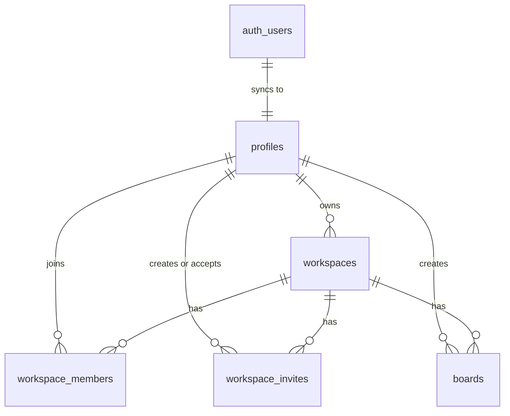

# Database Design

This document reflects the current Supabase PostgreSQL schema for Zentrox.

Supabase Auth owns private identity records in `auth.users`. The application stores public user metadata in `profiles`, then uses workspaces, members, invites, and boards as the core product tables.

---

## Runtime Connection Architecture

The app uses `@supabase/ssr` clients from `src/utils/supabase/`:

1. **Client Components:** `src/utils/supabase/client.ts`
2. **Server Components / Server Actions / Route Handlers:** `src/utils/supabase/server.ts`
3. **Proxy middleware:** `createMiddlewareClient` from `src/utils/supabase/server.ts`, consumed by `src/proxy.ts`

The current service layer:
- `src/services/profile.ts` — reads public profile rows by user id.
- `src/services/workspace.ts` — reads, creates, and deletes workspaces.
- `src/services/board.ts` — reads, creates, updates, and deletes boards.
- `src/services/member.ts` — manages workspace members (list, add, remove, update role).
- `src/services/invite.ts` — manages workspace invites (create, accept, revoke, list).
- `src/services/email.ts` — sends transactional emails via SendGrid for workspace invites.

The corresponding Server Actions layer:
- `src/actions/workspace.ts` — auth checks, validation, cache revalidation for workspace operations.
- `src/actions/board.ts` — auth checks, workspace access validation, cache revalidation for board operations.
- `src/actions/member.ts` — member CRUD and role management.
- `src/actions/invite.ts` — invite creation, acceptance, revocation.
- `src/actions/profile.ts` — profile updates and preferences.
- `src/actions/settings.ts` — settings-related mutations.
- `src/actions/auth.ts` — sign out and auth utility actions.

---

## Relationship Overview

---

## Table `profiles`

Public profile data synced from Supabase Auth.

### Columns

| Name | Type | Constraints |
|------|------|-------------|
| `id` | `uuid` | Primary |
| `email` | `text` |  |
| `name` | `text` | Nullable |
| `avatar_url` | `text` | Nullable |
| `created_at` | `timestamptz` |  |
| `updated_at` | `timestamptz` |  |

**Indexes:**
- `profiles_email_trgm_idx`: A GIN index using `gin_trgm_ops` from the `pg_trgm` extension on the `email` column. This optimizes `ILIKE '%query%'` substring searches used in the invite user suggestions dropdown.

## Table `workspaces`

Top-level container for boards and collaborators.

### Columns

| Name | Type | Constraints |
|------|------|-------------|
| `id` | `uuid` | Primary |
| `name` | `text` |  |
| `slug` | `text` |  |
| `owner_id` | `uuid` |  |
| `created_at` | `timestamptz` |  |
| `updated_at` | `timestamptz` |  |

## Table `workspace_members`

Maps users to workspaces and stores their role. Enabled for Supabase Realtime to broadcast access revocations and updates.

### Columns

| Name | Type | Constraints |
|------|------|-------------|
| `id` | `uuid` | Primary |
| `workspace_id` | `uuid` |  |
| `user_id` | `uuid` |  |
| `joined_at` | `timestamptz` |  |
| `role` | `WorkspaceRole` |  |

### Roles

`WorkspaceRole` currently supports:

- `owner`
- `admin`
- `editor`
- `viewer`

## Table `workspace_invites`

Stores pending or completed invitations to join a workspace. Enabled for Supabase Realtime to notify users of accepted invitations.

### Columns

| Name | Type | Constraints |
|------|------|-------------|
| `id` | `uuid` | Primary |
| `workspace_id` | `uuid` |  |
| `email` | `text` |  |
| `token` | `text` |  |
| `status` | `text` |  |
| `created_by` | `uuid` |  |
| `accepted_by` | `uuid` | Nullable |
| `role` | `WorkspaceRole` |  |
| `inviter_seen` | `boolean` | Default `false` |
| `created_at` | `timestamptz` | Default `now()`, Not Null (fixed via migration) |

## Table `boards`

Boards live inside a workspace. The drawing/canvas state is stored in `canvas_data`.

### Columns

| Name | Type | Constraints |
|------|------|-------------|
| `id` | `uuid` | Primary |
| `workspace_id` | `uuid` |  |
| `name` | `text` |  |
| `description` | `text` | Nullable |
| `created_by` | `uuid` |  |
| `created_at` | `timestamptz` |  |
| `updated_at` | `timestamptz` |  |
| `canvas_data` | `jsonb` |  |

---

## Current Implementation Notes

- Workspace creation inserts a row in `workspaces` **and** an owner row in `workspace_members` in a single action.
- Boards are typed and fully managed via server actions and supabase services.
- Canvas persistence is fully implemented: `boards.canvas_data` is saved via the sync server's autosave loop and can be manually saved via `updateBoardCanvasAction`.
- `canvas_data` is the single JSONB storage field for board drawing state.
- `workspace_invites.inviter_seen` is used to track whether the inviter has seen the accepted invite notification (enables real-time notifications).
- `workspace_invites.created_at` now has a proper `DEFAULT now()` constraint (added via migration `20260618160000`) and is guaranteed non-null.
- Supabase Realtime is enabled for `workspace_invites` and `workspace_members` tables to support live notifications and access revocation detection.
