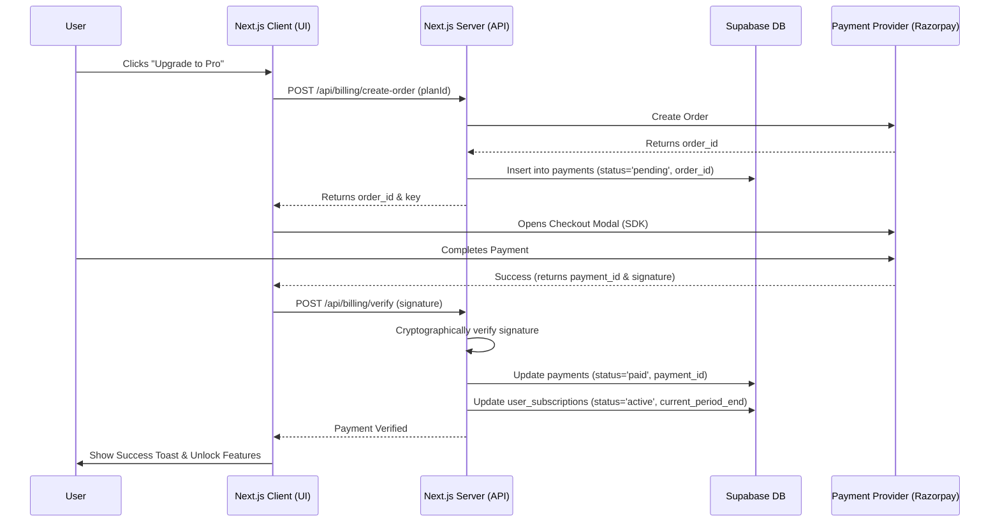
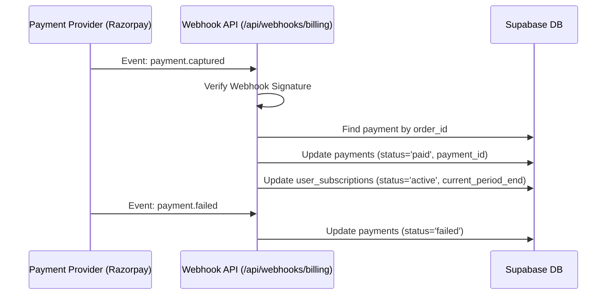

# Payment & Subscription Flow

This document outlines the step-by-step flow of how the payment and subscription system works in Zentrox, from the moment a user decides to upgrade, to how their permissions are enforced.

---

## 1. The Purchase Flow (Checkout)

When a user on the **Free** plan wants to upgrade to **Pro** or **Ultra** (as a one-time purchase), the following sequence occurs:



### Step-by-Step Breakdown
1. **Initiation**: The user selects a plan from the Settings > Billing tab or clicks an "Upgrade" prompt when hitting a limit.
2. **Order Creation**: The frontend calls our generic billing API. The API uses the Razorpay SDK to generate an `order_id` and stores a `pending` record in the `payments` table.
3. **Checkout**: The Razorpay SDK opens a secure payment modal directly on our site.
4. **Verification**: Once paid, Razorpay gives the frontend a signature. The frontend passes this to our backend to mathematically prove the payment is legitimate.
5. **Activation**: The backend updates the `payments` record to `paid` and updates the `user_subscriptions` table, instantly granting the user Pro/Ultra access for the duration of the plan.

---

## 2. The Webhook Flow (Background Verification)

While the checkout flow provides immediate access, we also rely on **Webhooks** as the source of truth to handle delayed payments or failed captures.



- **Why Webhooks?** If a user closes the browser before the frontend can send the verification, the webhook ensures we still grant them access once the payment clears.

---

## 3. Enforcement Flow (How Limits Work)

Once a user is upgraded, how does the app know to let them do things?

### Example: Creating a Workspace
When the user clicks "Create Workspace":
1. The frontend calls `createWorkspaceAction` (Server Action).
2. The server queries the `user_subscriptions` table for this user.
3. It sees `plan_type = 'pro'` and `status = 'active'`.
4. It counts the user's existing workspaces (e.g., they have 2).
5. Since the Pro limit is 3, the server creates the 3rd workspace successfully.
6. (If they try to create a 4th, the server throws an error and the frontend shows an Upgrade modal).

---

## 4. File Map (Implemented ✅)

```
src/
├── app/api/
│   ├── billing/
│   │   ├── create-order/route.ts       # POST — Creates Razorpay order, inserts pending payment
│   │   └── verify/route.ts             # POST — Verifies signature, activates subscription, revalidates cache
│   └── webhooks/
│       └── billing/route.ts             # POST — Handles payment.captured & payment.failed with sig verification
├── actions/
│   ├── settings.ts                      # getUserSubscriptionAction — fetches current subscription details
│   ├── workspace.ts                     # createWorkspaceAction — calls checkWorkspaceCreationLimit
│   ├── board.ts                         # createBoardAction — calls checkBoardCreationLimit
│   └── invite.ts                        # createInviteAction — calls checkMemberInviteLimit
├── components/
│   ├── billing/
│   │   ├── pricing-cards.tsx            # Reusable Free/Pro/Ultra tier comparison cards
│   │   └── upgrade-dialog.tsx           # Razorpay checkout modal with script loading & payment flow
│   └── settings/
│       ├── billing-tab.tsx              # Settings tab: current plan card, plan limits, upgrade button
│       ├── settings-sidebar.tsx         # Added "Billing" nav item (CreditCard icon)
│       ├── settings-content.tsx         # Renders BillingSettings when tab is "billing"
│       └── settings-modal.tsx           # Dialog description updated (no functional change)
├── services/
│   └── billing.ts                       # Generic adapter: createPaymentOrder, verifyPayment,
│                                        #   handleWebhookEvent, checkWorkspaceCreationLimit,
│                                        #   checkBoardCreationLimit, checkMemberInviteLimit
├── store/
│   └── settings-store.ts                # Added "billing" to SettingsTab type union
├── types/
│   └── billing.ts                       # PlanType, UserSubscription, Payment, PLAN_LIMITS constants
└── lib/
    └── razorpay.ts                      # Razorpay SDK initialization (pre-existing)

supabase/migrations/
└── 20260619000000_create_billing_tables.sql  # user_subscriptions + payments tables, enums, RLS, trigger
```

## 5. Required Environment Variables

| Variable | Source | Description |
|:---------|:-------|:------------|
| `RAZORPAY_KEY_ID` | Razorpay Dashboard → Settings → API Keys | Your publishable API key (starts with `rzp_live_` or `rzp_test_`) |
| `RAZORPAY_KEY_SECRET` | Razorpay Dashboard → Settings → API Keys | Your secret key for signing orders |
| `RAZORPAY_WEBHOOK_SECRET` | Razorpay Dashboard → Settings → Webhooks | Secret for verifying webhook payload signatures |

---

## 6. Limit Enforcement Summary

| Action | Free | Pro (₹499) | Ultra (₹1499) |
|:-------|:-----|:-----------|:--------------|
| **Workspaces** | 1 | 3 | Unlimited |
| **Boards per workspace** | 3 | 10 | Unlimited |
| **Members per workspace** | 0 (owner only) | 10 | Unlimited |

- **Soft limits:** Existing data is preserved when users exceed limits. Only new creations are blocked.
- **Error messages:** Descriptive messages tell users their current limit and what upgrade is needed.
