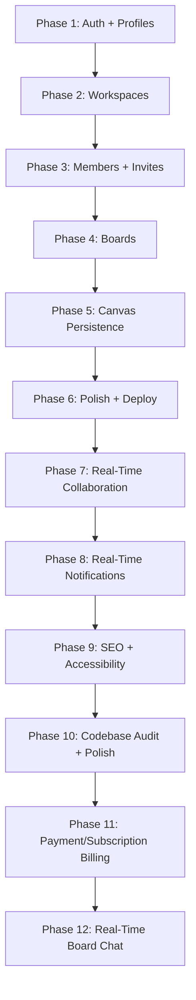
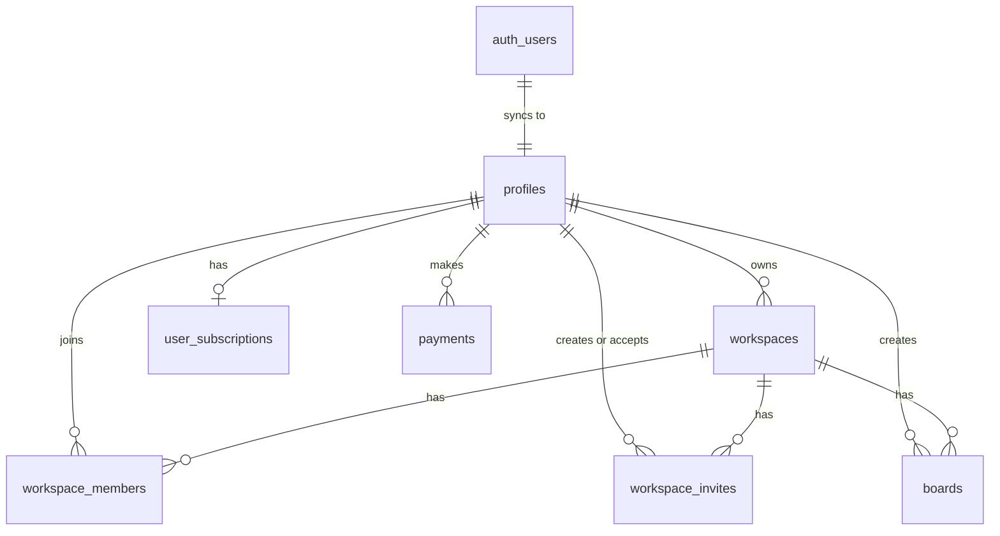

# Project Lifecycle: Practical Build Phases

This document defines the current build phases for Zentrox. It replaces the older deep roadmap with a smaller, realistic plan focused on the app being built now.

Reference docs:
- [README.md](../README.md)
- [database.md](database.md)

---

## Current Tech Stack

- **Frontend:** Next.js 16 App Router, React 19, TypeScript, Tailwind CSS v4, shadcn/ui, Aceternity UI, Radix primitives, lucide-react, Sonner, Motion (animations)
- **State, Forms, Validation:** Zustand, React Hook Form, Zod 4.4.3, `@hookform/resolvers`
- **Backend:** Next.js Server Actions, Route Handlers, Supabase SSR SDK
- **Database:** Supabase PostgreSQL (7 tables: profiles, workspaces, workspace_members, workspace_invites, boards, user_subscriptions, payments)
- **Canvas:** tldraw 5.1.0 with `boards.canvas_data` persistence, role-based read-only mode, and real-time multi-user sync via `@tldraw/sync` / `@tldraw/sync-core`
- **Payments:** Razorpay SDK v2.9.6 with HMAC crypto-signed verification and webhook fallback
- **Analytics & Monitoring:** PostHog (client: posthog-js, server: posthog-node), @vercel/analytics, @vercel/speed-insights
- **Email:** SendGrid (@sendgrid/mail) — transactional emails for workspace invites
- **Sync Server:** tldraw sync backend (WebSocket) deployed to Render
- **Testing:** Vitest, @testing-library/react, jsdom (284 tests, 26 files)
- **Additional:** next-themes (dark mode), simplex-noise (UI effects), tw-animate-css (animations)

Not in the current scope: comments, AI diagram generation, AI chat, or a large realtime architecture.

---

## Build Sequence

---

## Database Entity Relationships

---

## Phase 1: Auth and Profiles

**Goal:** Users can register, log in, log out, and have a public profile row.

- Supabase email/password auth
- GitHub OAuth callback flow
- Protected routes through `src/proxy.ts`
- `profiles` table sync from `auth.users`
- Auth form validation with React Hook Form and Zod

## Phase 2: Workspaces

**Goal:** Users can create, list, and delete owned workspaces.

- `/workspaces` dashboard
- Workspace create/delete dialogs
- Workspace service layer and Server Actions
- Zustand store for hydrated workspace/user state
- Creator automatically gets an `owner` row in `workspace_members`

## Phase 3: Members and Invites ✅

**Goal:** Workspaces can support collaborators using existing database tables.

- Member list with role badges on the workspace detail page
- `InviteMemberDialog` — create invite links with role selection (owner/editor/viewer)
- Invite acceptance at `/invite/[token]` via `InviteAcceptClient`
- `useMemberStore` Zustand store for optimistic member/invite UI updates
- Member removal and role update actions (`src/actions/member.ts`)
- Invite creation, acceptance, and revocation actions (`src/actions/invite.ts`)
- `LeaveWorkspaceDialog` for non-owner members to leave a workspace
- Role-based access: board creation restricted to owners; editors/viewers get read-only canvas
- Vercel Analytics added to the root layout

## Phase 4: Boards

**Goal:** Users can create and manage boards inside a workspace.

- Board list inside `/workspaces/[workspaceId]`
- Board create/edit/delete actions
- Board detail route at `/board/[boardId]`
- Board ownership/access checks through workspace membership

## Phase 5: Canvas Persistence ✅

**Goal:** Users can open a board, draw, save, and reload their canvas.

- tldraw canvas embedded in `/board/[boardId]`
- Load board `canvas_data` from Supabase on open
- Auto-save canvas changes back to `boards.canvas_data`
- Basic save status and error indicators
- Role-based read-only mode: `isReadonly` set for editors and viewers

## Phase 6: Polish and Deployment Readiness

**Goal:** Make the core app stable enough to deploy.

- Not-found and empty states
- Loading states
- Form/server error consistency
- Environment variable docs
- `npm run lint` and `npm run build`

## Phase 7: Real-Time Collaboration ✅

**Goal:** Enable live multi-user editing on the same board using a custom tldraw WebSocket sync server and TLSocketRoom presence.

- tldraw sync backend: WebSocket server (`@tldraw/sync`, `@tldraw/sync-core`)
- Replace single-user `Tldraw` with `useSync` hook in `WhiteboardCanvas`
- Asset store for file/image uploads within the canvas
- Room persistence and reconnection handling on the backend
- Live cursor presence for connected users
- Test concurrent edits across multiple browser sessions
- TLSocketRoom presence channel on the sync server to track active collaborators
- Live avatar stack and join/leave toast notifications showing who is currently on the canvas

## Phase 8: Real-Time Notifications and Advanced Controls ✅

**Goal:** Provide live feedback for workspace events and enhance access control dynamics.

- Real-time notification inbox for workspace activities (e.g. invites).
- Supabase Realtime subscriptions for `workspace_invites` and `workspace_members`.
- `useNotificationStore` Zustand store for managing global notification state.
- `inviter_seen` field on `workspace_invites` to track accepted invite notifications.
- Refactored and modularized invite management UI (`InviteMemberDialog` with `invite-form`, `invite-success`, `invite-suggestions`).
- Enhanced whiteboard access control with real-time revocation monitoring (`KickedOverlay`).
- New reusable UI components: `DropdownMenu`, `Pagination`.
- `WorkspaceMemberRow` component extracted for role management.

## Phase 9: SEO, Accessibility, and Codebase Polish ✅

**Goal:** Improve search engine visibility, enhance accessibility, and resolve strict compiler/linter warnings.

- Dynamic `sitemap.ts` and `robots.ts` for SEO.
- Aceternity UI components (`HoverBorderGradient`, `WavyBackground`, `GlowingStars`, `Meteors`) integrated into landing pages.
- Accessibility (A11y) enhancements: improved contrast, ARIA labels, and touch targets.
- Resolution of React 19 / Next.js 15 compiler warnings (`react-hooks/purity`, `set-state-in-effect`).
- Strict typing compliance (`any` → `unknown`).
- Fixed unescaped HTML entities in legal pages and empty states.
- Added `AnimatedThemeToggler` for dark/light mode.

## Phase 10: Codebase Audit and Polish ✅

**Goal:** Eliminate dead code, consolidate duplicates, fix production-readiness issues, and add UI polish.

- Updated `.env.example` with correct environment variables (SendGrid, PostHog, Supabase).
- Removed dead commented-out code throughout the codebase.
- Fixed hardcoded year in footer (2024 → dynamic).
- Fixed comment mismatch in whiteboard canvas (5s → 10s).
- Extracted shared `formatDate` and `hasManagePermission` helpers to `lib/utils.ts`.
- Reused `GithubIcon` component in footer instead of duplicating SVG.
- Fixed hardcoded route strings to use `ROUTES` constants.
- Fixed silent error returns in server actions (now throw instead of returning `[]`).
- Fixed ReactDOM import to use named import.
- Added role selector dropdown to invites tab (viewer/editor/admin).
- Created shared `usePagination` hook extracted from board-list and workspace-list.
- Replaced comma-separated email input with capsule/pill-style email input (Enter to add, X to remove, max 10).
- Fixed Sent At column missing `created_at` in database (added migration).
- Added profile search suggestions to invites tab (debounced, shows registered users).
- Added Radix `DialogDescription` to settings modal for accessibility compliance.
- Created migration to add `created_at` column to `workspace_invites` with proper defaults.
- **Settings modal** with tabbed UI: Profile, Workspaces, Notifications, Appearance, Account, Members, Invites.
- **PostHog analytics** integrated at both client and server levels.
- **Comprehensive test suite** — 284 tests across 26 files covering all critical paths.
- **Performance monitoring** via @vercel/speed-insights.
- **Error boundary** added for whiteboard canvas crash protection.
- All documentation audited and updated.

## Phase 11: Payment/Subscription Billing with Razorpay ✅

**Goal:** Implement tiered subscription plans (Free/Pro/Ultra) with Razorpay payment processing, cryptographic signature verification, and plan limit enforcement across workspaces, boards, and member invites.

- **Database:** `user_subscriptions` and `payments` tables with enums, RLS, indexes, and auto-creation trigger.
- **Service Layer:** `src/services/billing.ts` with `createPaymentOrder`, `verifyPayment`, `handleWebhookEvent`, `getUserSubscription` (with expiry detection), and limit check functions.
- **API Routes:** Razorpay order creation (`POST /api/billing/create-order`), payment verification (`POST /api/billing/verify`), and webhook handler (`POST /api/webhooks/billing`).
- **Client-Side Checkout:** `useRazorpay` hook with script loading, checkout opening, payment verification, and subscription cache invalidation.
- **Pricing UI:** `PricingCards` (Free/Pro/Ultra tier comparison), `UpgradeDialog` (limit enforcement), `PricingPageClient` (public pricing page).
- **Settings Billing Tab:** Current plan card with usage limits, transaction history with printable receipts, pricing cards, cancel subscription flow.
- **Limit Enforcement:** Proactive checks in creation dialogs (`CreateWorkspaceDialog`, `CreateBoardDialog`, `InviteMemberDialog`) with visual usage bars and upgrade prompts.
- **Server-Side Enforcement:** Limit checks in `createWorkspaceAction`, `createBoardAction`, `createInviteAction`, and `bulkInviteUsersAction`.
- **Plan Badge:** Workspace detail page sidebar shows workspace owner's plan type.
- **Security:** HMAC cryptographic signature verification, Razorpay API re-verification, idempotency checks, admin Supabase client for billing operations.
- **Soft Limits:** Existing data preserved — only new creation is blocked.

---

## Phase 12: Real-Time Board Chat & Workspace Activity Timeline ✅

### Real-Time Board Chat

**Goal:** Enable real-time per-board chat with Supabase Realtime subscriptions, @mentions with auto-complete, reply-to threading, and a shadcn sidebar UI.

- **Database:** `board_messages` table with `reply_to_message_id` self-reference and Supabase Realtime publication.
- **Types:** `BoardMessage`, `BoardMessageSender`, `BoardMessageReplyTo` in `src/types/chat.ts`.
- **Service layer:** `fetchBoardMessages()`, `insertBoardMessage()` in `src/services/chat.ts` with joined profile and reply chain hydration.
- **Server Actions:** `getBoardMessagesAction()`, `sendBoardMessageAction()` in `src/actions/chat.ts` with auth and workspace access checks.
- **Zustand Store:** `useChatStore` handling `messages`, `isOpen`, `unreadCount`, `replyingTo`, `isLoading` with duplicate prevention and board-switch reset.
- **Realtime Hook:** `useBoardChat` in `src/components/whiteboard/hooks/use-board-chat.ts` — fetches initial messages and subscribes to INSERTs.
- **Sidebar UI:** shadcn `Sidebar` component (`side="right"`, `collapsible="offcanvas"`, 350px width) with header, scrollable messages (`ChatMessageList`), and footer input (`ChatInput`).
- **Chat Input:** Auto-resizing textarea with mention badge system (chip/@Name + X), inline `ChatMentionPicker` (avatar + name + email), reply-to context bar, and optimistic UI clear.
- **Message Display:** @mention rendering (`@<email>` → styled @DisplayName), reply chain preview, "Read more"/"Show less" for long messages.
- **Mention Picker:** Filters workspace members by name or email.
- **Integration:** `ChatSidebar` controlled via `SidebarProvider` in `WhiteboardEditor`; `HeaderChatToggle` in `EditorHeader` using `useSidebar()` context with unread badge.
- **Styling:** z-index 100 (above canvas tools), full viewport height, sidebar width 350px.

### Workspace Activity Timeline (Audit Log)

**Goal:** Build an immutable audit log of workspace events with a real-time vertical timeline UI, color-coded icons, and human-readable event messages.

- **Database:** `workspace_activities` table with `action_type`, `entity_type`, `entity_id`, `metadata` (jsonb), `REPLICA IDENTITY FULL`, indexes on `workspace_id` and `created_at DESC`, and Supabase Realtime publication.
- **Types:** `ActivityActionType` (13 event types), `ActivityEntityType`, `WorkspaceActivity`, `WorkspaceActivityWithProfile` in `src/types/activity.ts`.
- **Service layer:** `logActivity()` (silent-fail pattern), `fetchWorkspaceActivities()` (joined with profiles) in `src/services/activity.ts`.
- **Zustand Store:** `useActivityStore` with `activities`, `isLoading`, `addActivity` (insert at front + sort by created_at).
- **UI Utils:** `getActivityIcon()`, `getActivityColor()`, `formatActivityMessage()`, `formatActivityTitle()` in `src/utils/activity-utils.tsx` (uses `react-icons/fa` for icons).
- **Components:** `TimelineItem` (color-coded icon + avatar + human-readable message) and `WorkspaceTimeline` (responsive vertical timeline with legend, real-time subscription, empty/loading states) in `src/components/workspace/activity/`.
- **Integration:** Logging hooked into 9 Server Actions across board, workspace, invite, member, and profile domains. Timeline accessible via "Activity Timeline" tab toggle on workspace detail page.
- **Server-side hydration:** `initialActivities` fetched in workspace detail page and passed to `WorkspaceDetailsClient`.

## Later / Optional

These features can be revisited after the core product is working:

- AI features
- Recurring subscription billing (auto-renew with Razorpay Subscriptions API)
- Advanced scaling infrastructure
- Chat file/image attachments
- Chat message editing and deletion
- Chat search
- RLS policies for `board_messages` (currently omitted)
